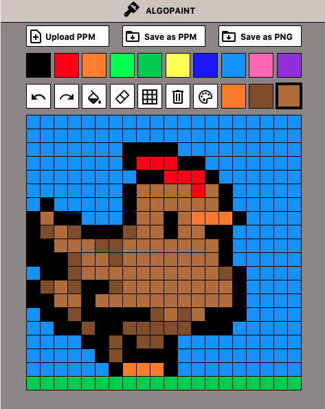

<div align="center">
  <a href="https://github.com/othneildrew/Best-README-Template">
    
  </a>
  <p align="center">
    <h1> ALGOPAINT <h1 />
  </p>
</div>
      
## About The Project
<div style="display: flex; flex-direction: column;">
  <div style="display: flex; justify-content: space-between;">
    
    
  </div>
  <div style="display: flex; justify-content: space-between;">
    
    
  </div>
</div>

### Overview
This project is a simple paint application implemented in Python using the `gamelib` library, which is based on Tkinter. The paint application provides a user-friendly interface to draw and create digital art with various tools and features.
### Features
The paint application offers the following set of tools and features:

* **Save and Load Images**: Users can save their images in multiple formats, including PPM and PNG, and load previously saved images in PPM format.
* **Shortcut Color Bar**: A color bar displaying 10 predefined colors that users can quickly select for drawing.
* **Undo and Redo**: The ability to undo and redo previous actions to easily correct mistakes or make changes.
* **Bucket Fill**: An option to fill a contiguous area of pixels with a selected color, similar to a paint bucket tool.
* **Eraser**: An eraser tool to remove specific color pixels.
* **Pixels Border Visibility**: Users can choose whether to display the borders of pixels for a better visual experience.
* **Clear All**: A button to clear the entire image, allowing users to start fresh.
* **Custom Color Palette**: Users can enter custom colors in the format "#rrggbb" (hexadecimal) to create and use their preferred colors. The palette can store up to three custom colors at a time as a shortcut.
  
## Prerequisites
* **Python 3**: Before running this application, please ensure that you have Python installed on your computer. You can download the latest stable version of Python from the official website: https://www.python.org/downloads/
* **Note**: This application utilizes the "gamelib" library, which is already included in the code. You don't need to install any external dependencies separately.
## Usage
1. Download the ZIP file or clone the repository.
2. Open a terminal (Command Prompt, PowerShell on Windows; Terminal on macOS/Linux).
3. Navigate to the directory where "main.py" is located using the cd command. For example: `cd /path/to/your-repo` (replace "/path/to/your-repo" with the actual path to the directory where "main.py" is located).
4. Run the application using the following command:
   ```sh
   python3 main.py
      ```
## Contact
If you have any questions, feedback, or suggestions regarding the project, feel free to reach out:

* Email: martinbucca02@gmail.com
* [GitHub](https://github.com/martinbucca)
* [Linkedin](https://www.linkedin.com/in/mart%C3%ADn-bucca-70858a216/)
  
Your feedback is highly appreciated!
